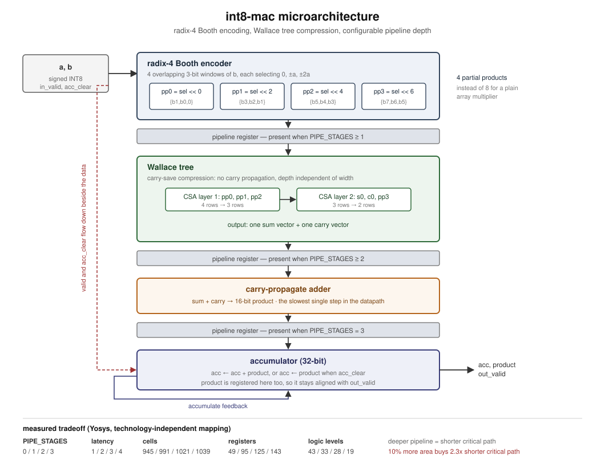

# int8-mac

A pipelined signed INT8 multiply-accumulate datapath in Verilog, built
from a radix-4 Booth encoder and a Wallace tree, with the pipeline depth
as a parameter so the area/timing tradeoff can actually be measured
rather than asserted.



## What it computes

```
acc <= acc + (a * b)        a, b signed 8-bit, acc signed 32-bit
acc <= a * b                when acc_clear is asserted with the operands
```

`in_valid` and `acc_clear` flow down the pipeline beside the data, so
the accumulator only updates on cycles where a real product arrives and
idle cycles are harmless. Latency from `in_valid` to `out_valid` is
`PIPE_STAGES + 1`.

## Why Booth and Wallace

A plain 8x8 array multiplier generates 8 partial products and reduces
them with a chain of carry-propagate adders. This datapath does neither:

- **Radix-4 Booth encoding** looks at 4 overlapping 3-bit windows of the
  multiplier, each selecting one of `{0, ±a, ±2a}`. That is **4 partial
  products instead of 8**, halving the rows the compressor has to reduce.
- **A Wallace tree** reduces those 4 rows to 2 using carry-save adders.
  A CSA is just a row of independent full adders with no carry
  propagation along the word, so its delay is constant regardless of
  width, and tree depth grows logarithmically with the number of rows
  rather than linearly.
- **One carry-propagate addition** remains at the very end, which is the
  slowest single step and therefore the natural place to put a register.

## The pipeline-depth tradeoff

`PIPE_STAGES` (0 to 3) chooses where registers sit. Same datapath, four
build points. Measured with Yosys after technology-independent mapping
and flattening (`syn/compare.sh`):

| PIPE_STAGES | latency | cells | registers | logic levels |
|---|---|---|---|---|
| 0 | 1 cycle  |  945 |  49 | 43 |
| 1 | 2 cycles |  991 |  95 | 33 |
| 2 | 3 cycles | 1021 | 125 | 28 |
| 3 | 4 cycles | 1039 | 143 | 19 |

Logic levels is the longest topological path through combinational
logic, which stands in for the critical path: fewer levels between
registers means a higher achievable clock. Going from depth 0 to depth 3
costs about **10% more cells and 3 extra cycles of latency, and shortens
the critical path by roughly 2.3x**. That is the whole tradeoff in one
table: area and latency bought clock frequency.

For real nanosecond numbers this would need STA against a liberty file;
logic levels is the tool-independent stand-in.

Reproduce with:

```bash
sudo apt install yosys
cd syn && ./compare.sh
```

## Running the tests

```bash
sudo apt install iverilog gtkwave
pip install cocotb

cd tb
make                  # default depth (3)
make PIPE_STAGES=1    # any single depth
make all-depths       # the full regression at 0, 1, 2 and 3
```

6 test groups, all passing at **every** pipeline depth:

```
test_exhaustive_products            PASS   all 65536 signed 8x8 products
test_random_mac_stream              PASS   500 MACs vs a Python accumulator
test_corner_operands                PASS   -128, -127, -1, 0, 1, 127 pairs
test_valid_gaps                     PASS   random idle cycles between operands
test_accumulator_clear              PASS   clear replaces rather than adds
test_latency_matches_pipeline_depth PASS   latency == PIPE_STAGES + 1
```

The exhaustive test is the useful one: every one of the 65536 possible
signed products is streamed through and checked, so a Booth encoding
mistake cannot hide in some rare operand combination. `-128` gets its
own test because negating it overflows 8 bits, which is exactly where a
careless Booth implementation breaks.

The RTL is clean under `verilator --lint-only -Wall`.

## Repo layout

```
rtl/     booth_pp_gen.v, csa.v, wallace_tree.v, mac_int8.v
tb/      cocotb testbench + Makefile (per-depth builds)
syn/     compare.sh — Yosys area/logic-depth sweep
docs/    microarchitecture diagram
```

## Notes / possible extensions

- The CSA tree is written for exactly 4 partial products. Generalising
  it to an N-row reduction generator would let the same code serve wider
  operands.
- Booth negation is handled by returning the two's complement directly
  from the select function. A production design would usually push the
  `+1` correction terms into the tree as an extra row to save the
  incrementers.
- No saturation on the accumulator: 32 bits is enough for 65536 INT8
  MACs before overflow, but a real accelerator would want saturating or
  configurable-width accumulation.
- The natural next step is tiling this MAC into a systolic array, which
  is what the companion project does.
